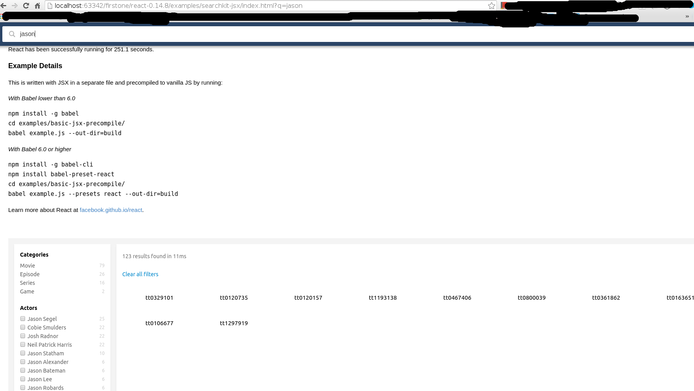
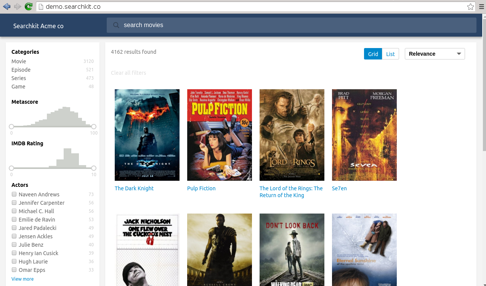

Compiling searchkit.jsx to searchkit.js and less using node.js for development
========================

Today I tried to embed `react` with ElasticSearch using searchkit.
I am not a fan of `node.js`, so I try to find my way of making it work.


Embedding `react` and `searchkit` in HTML
--------------------------------
For people don't need to know how to use node.js serve apps. If you want to use `react`
with other languages, such as `go, python, php, etc.`

In fact **searchkit** is built on `react` and it can work as a nodejs app. Or we
can run this app with plain JS, css, HTML. `react` uses native `javascript` and `jsx`.
If using `jsx` we should compile/convert it to native `javascript` for browser.

Let's say, you write `react` in language `jsx`, and you deploy the app in native
`js` which is converted from `jsx` for browser.

Remember that we should add
this line in `index.html`

```
<script type="text/javascript" src="//cdn.jsdelivr.net/searchkit/0.9.2/bundle.js"></script>
```

In this way, we can have a variable called `Searchkit`.

the file `searchkit.jsx` is written in `jsx` which is in language of `babel jsx`.
I installed `babel-cli` to compile the `searchkit.jsx` file into `build/searchkit.jsx`.

```
babel searchkit.jsx --presets react --out-dir=build
```

Then add it to `index.html`

```
<script src="build/searchkit.js"></script>
```

But all the naming variables in this file can not be used. For example, the
variable `SearchkitManager`, we can not use it simply in file `searchkit.js`,
instead we should use `Searchkit.SearchkitManager`. Here I added `Searchkit` before
all the variables in file `Searchkit.js` by hands. And it works.



Comparing to its official demo site, we are lack of some static files.
But here we only prove converting `jsx` to `js` and it is proved.




References
---------

Read more about **react** from [here](http://facebook.github.io/react/docs/getting-started.html)

Read more about **searchkit** from [here](http://www.searchkit.co/)

For more information about how to use `babel` to convert `*.jsx` to `*.js`, just read


<h4>Example Details</h4>
<p>This is written with JSX in a separate file and precompiled to vanilla JS by running:</p>

<p><i>With Babel lower than 6.0</i></p>
<pre>npm install -g babel
cd examples/basic-jsx-precompile/
babel example.js --out-dir=build</pre>

<p><i>With Babel 6.0 or higher</i></p>
<pre>npm install -g babel-cli
npm install babel-preset-react
cd examples/basic-jsx-precompile/
babel example.js --presets react --out-dir=build</pre>
<p>
  Learn more about React at
  <a href="https://facebook.github.io/react" target="_blank">facebook.github.io/react</a>.
</p>